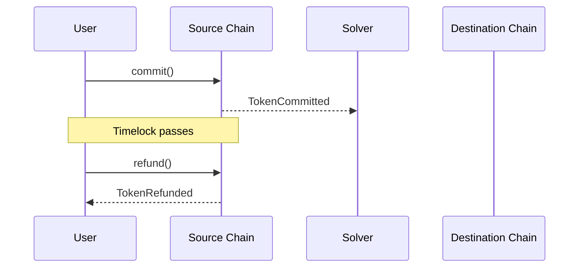
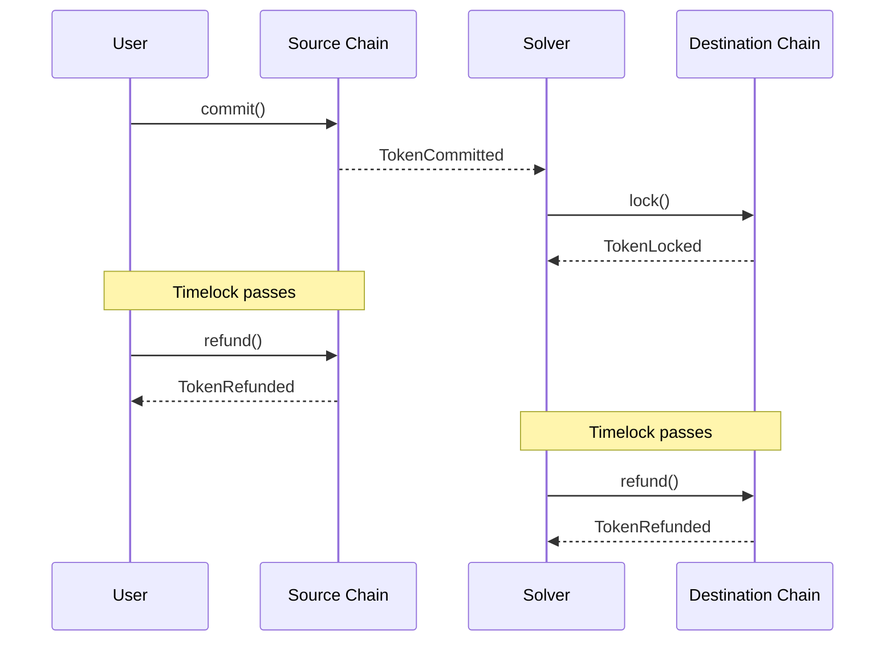
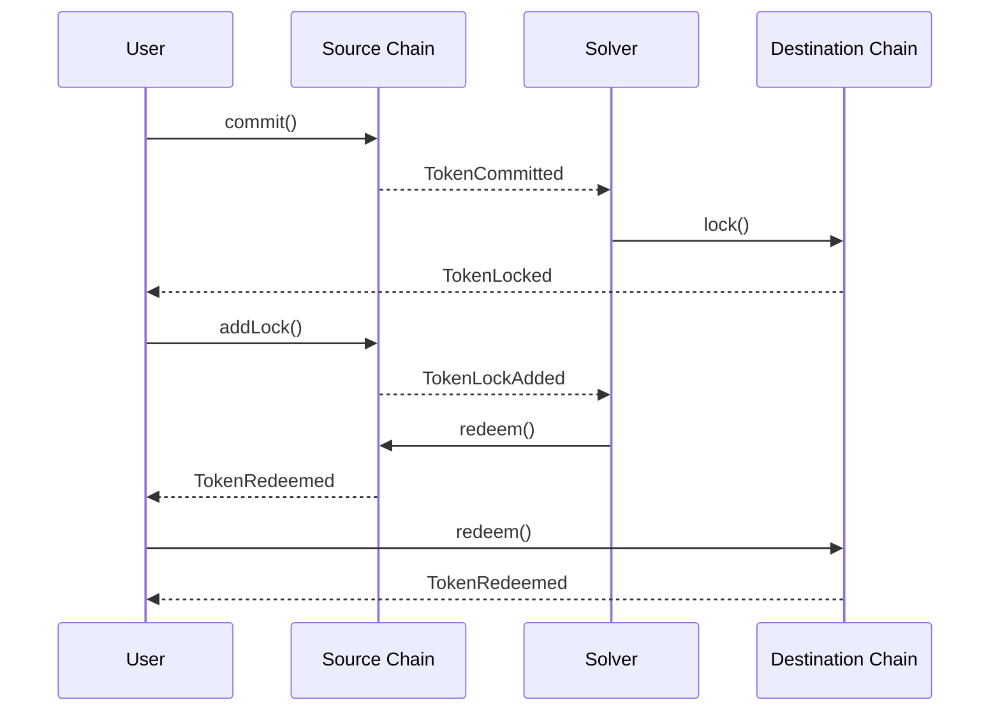
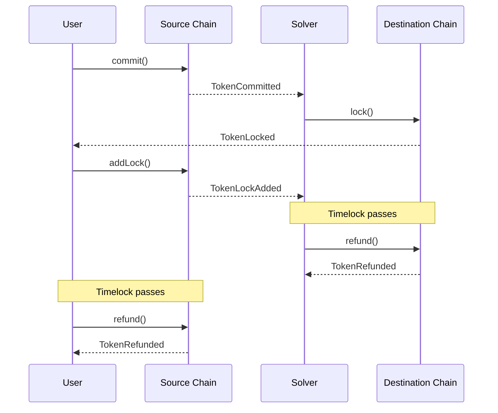

### Solver fails to act on the User's commitment/intent
In a rare scenario where the winning Solver fails to act on the user's commitment, other auction participants have a chance to lock instead of the winner. Even if they fail to do so, the user just has to wait for the timelock (usually ~15 minutes) and receive their funds back.

<Accordion title="Sequence Diagram" icon="brake-warning">

</Accordion>

### User fails to act on the Solver's lock

If the user does not act on the lock created by the Solver, after the timelock passes, both the Solver and the user can refund their funds.

<Accordion title="Sequence Diagram" icon="brake-warning">

</Accordion>

### Solver fails to release the User's funds

In the scenario where the Solver releases their funds but fails to release the user's funds, the user can capture the secret used to release the Solver's funds and manually release their own funds on the destination chain.

<Accordion title="Sequence Diagram" icon="brake-warning">

</Accordion>

### Solver fails to release any funds

If, for any reason, the Solver fails to release the funds at all, the user can simply wait for the timelock to pass and refund their funds back.

<Accordion title="Sequence Diagram" icon="brake-warning">

</Accordion>

