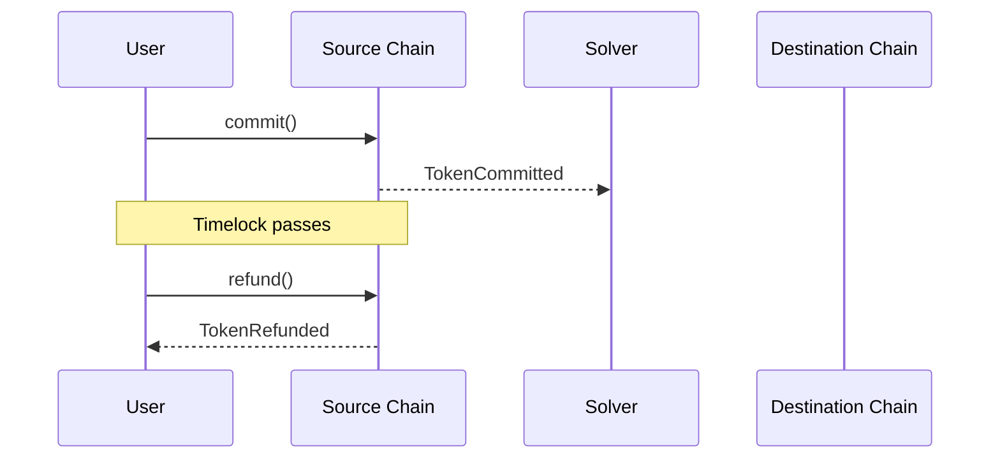
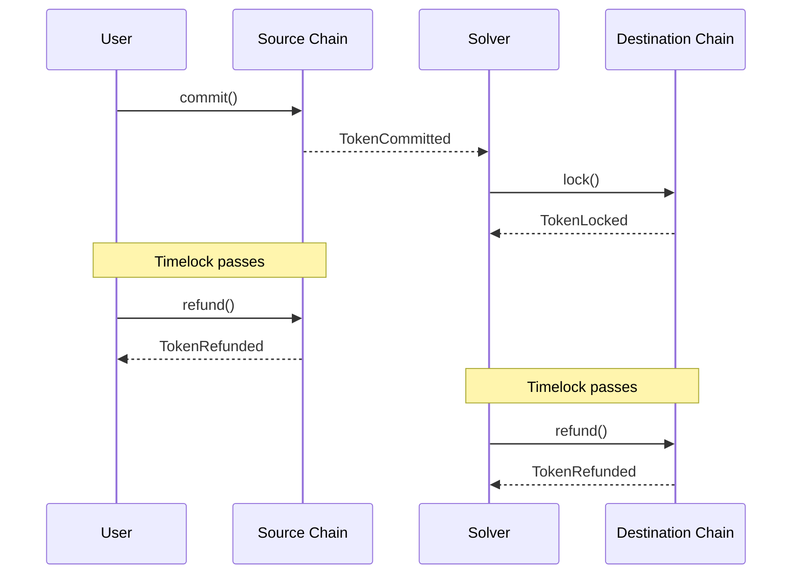
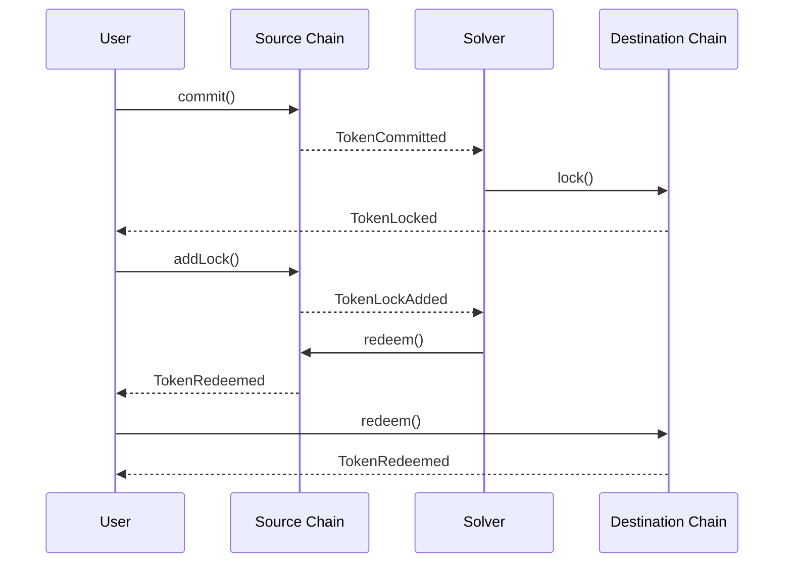
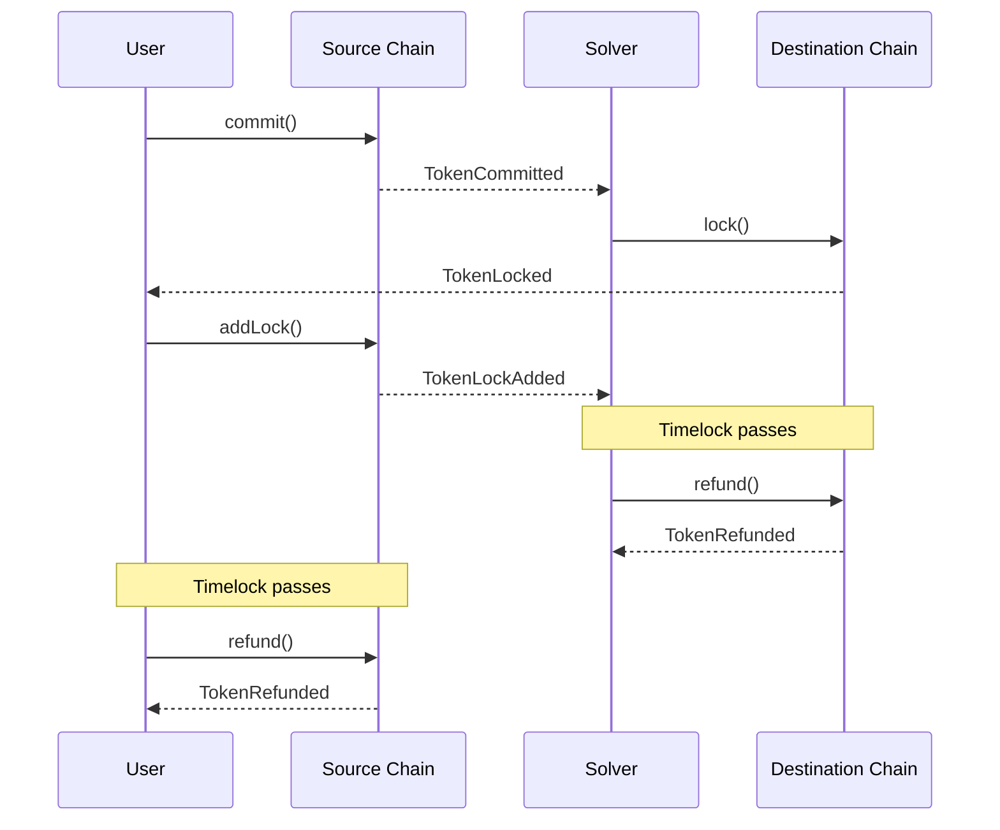

### Solver Fails to Act on the User's Commitment/Intent
In a rare scenario where the winning Solver fails to act on the User's commitment, other auction participants have a chance to lock instead of the winner. If all participants fail to act, the User only needs to wait for the timelock period (usually ~15 minutes) to receive their funds back.

<Accordion title="Sequence Diagram" icon="brake-warning">

</Accordion>

### User Fails to Act on the Solver's Lock

If the User does not act on the lock created by the Solver, both parties can refund their funds after the timelock period expires.

<Accordion title="Sequence Diagram" icon="brake-warning">

</Accordion>

### Solver Fails to Release the User's Funds

In scenarios where the Solver releases their funds but fails to release the User's funds, the protocol provides two mechanisms:

1. **Manual Redemption**: The User captures the secret revealed when the Solver redeemed on the source chain. The User can then use this secret to manually redeem their own funds on the destination chain, bypassing the Solver's failure.

2. **Reward/Slash Mechanism**: The Auction Manager tracks Solver reliability and reputation. Other solvers can redeem on behalf of the user and earn a reward for completing the swap. The original solver who failed is penalized through reputation loss and potential slashing, reducing their ability to win future auctions and incentivizing reliable behavior.

<Accordion title="Sequence Diagram" icon="brake-warning">

</Accordion>

### Solver Fails to Release Any Funds

If the Solver fails to release any funds, the User can wait for the timelock period to expire and then refund their funds.

<Accordion title="Sequence Diagram" icon="brake-warning">

</Accordion>