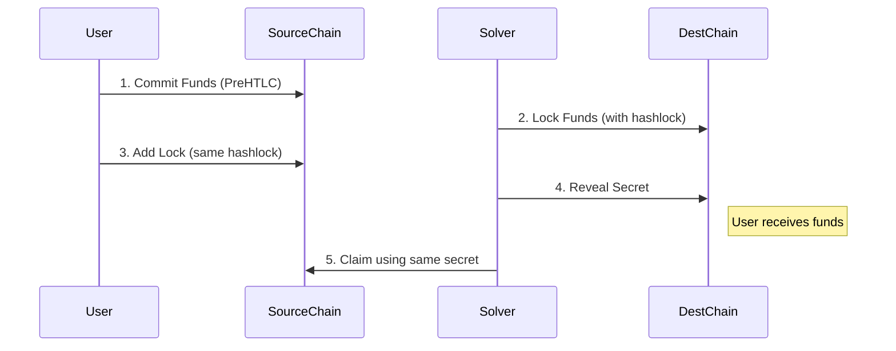

TRAIN (TRustless Atomic INtents) is a permissionless cross-chain bridging protocol that enables secure asset transfers between different blockchain networks without requiring trust in intermediaries.

<Frame>

</Frame>

## Core Components

The protocol consists of four main components that work together to enable secure cross-chain transactions:

<CardGroup cols={2}>
  <Card title="PreHTLC Contracts" icon="file-lock">
    Smart contracts deployed on each supported network that handle the secure locking and unlocking of assets
  </Card>
  <Card title="Discovery Registry" icon="lighthouse">
    On-chain registry where Solvers and networks register to participate in the protocol
  </Card>
  <Card title="Auction System" icon="scale-balanced">
    Matches users with Solvers to determine optimal routes and prices
  </Card>
  <Card title="Bridge dApp" icon="browser">
    User interface that coordinates the components and executes the atomic swaps
  </Card>
</CardGroup>

## How It Works

<Steps>
  <Step title="User Initiates Transfer">
    - User connects to the Bridge dApp and specifies transfer details
    - dApp queries the Discovery Registry for available Solvers and routes
    - Auction system collects quotes from eligible Solvers
  </Step>
  
  <Step title="Atomic Swap Setup">
    - User commits funds through PreHTLC on source chain
    - Selected Solver sees commitment and locks funds on destination chain
    - User confirms Solver's lock and finalizes the commitment
  </Step>
  
  <Step title="Asset Exchange">
    - Solver reveals the secret to release user's funds on destination chain
    - Same secret allows Solver to claim their funds on source chain
    - Transaction completes atomically - either both transfers succeed or both fail
  </Step>
</Steps>

## Key Features

### Multi-Hop Transactions
When no direct Solver exists between two chains, the protocol can automatically route transactions through multiple Solvers:

<Note>
Chain A → Solver(AB) → Chain B → Solver(BC) → Chain C
</Note>

The same cryptographic lock is used across all hops, ensuring atomic execution of the entire route.

### Security Guarantees

- **Trustless**: No third party can access user funds
- **Non-custodial**: Users maintain control of their assets until the swap completes
- **Atomic**: Transactions either complete fully or revert completely
- **Verifiable**: All operations can be verified on-chain
- **Immutable**: Contracts cannot be upgraded or modified

### Reward & Slashing

To incentivize proper behavior, Solvers must lock additional funds as a reward/penalty:

- Reward returned to Solver if they complete the transfer promptly
- Reward given to whoever completes the transfer if Solver fails to act

## Protocol Flow

This trustless design enables secure cross-chain asset transfers while maintaining the decentralized nature of blockchain technology. The protocol is permissionless, allowing any network to be added by implementing the PreHTLC standard and registering in the Discovery contract.